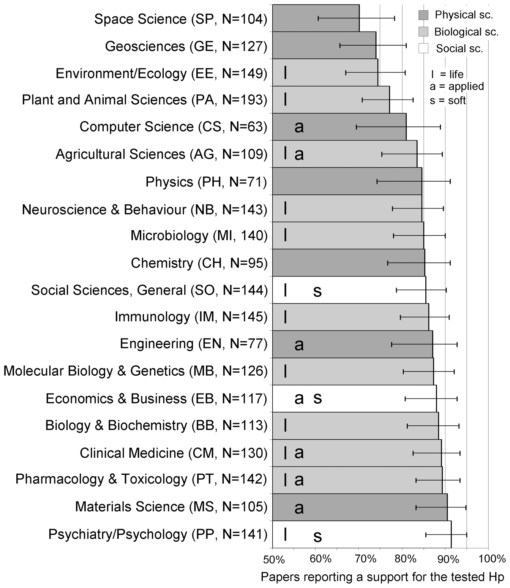

# 學術品質與誠信的界線：談開放科學的興起與現況 {data-background="https://cdn.cos.io/media/images/amazon-research-3.original.jpg"}

## 自我介紹

陳紹慶  
慈濟大學人類發展與心理學系專任副教授

 <small>開放科學中心大使</small></br>
 
<small>心理科學加速器創始成員；訓練委員會助理監督</small></br>
 [<small>scchen.com</small>](http://scchen.com)

<a rel="license" href="http://creativecommons.org/licenses/by/4.0/"></a>  <small>[Fork my slides on Github](https://github.com/SCgeeker/NCKU0803talk)</small>

# 開場暖身

## 我正在進行的研究主題

----

閱讀句子的心像模擬歷程

----


----

**Orientation** Stanfield & Zwaan (2001)

{width=150%}

<small>source: Bergen (2012)</small>

----

**Shape** Zwaan, Stanfield, & Yaxley (2002)

{width=150%}

<small>source: Bergen (2012)</small>

----

**Color** Connell(2005, 2007)

{width=150%}

<small>source: Bergen (2012)</small>

----

潛在應用：人類語言的圖像式處理

----


----

Q1：你認為這樣的研究渉及捏造(fabrication)與篡改(falsification)嗎？


# 2011:心理科學再現危機元年

## Diederik Stapel造假事件

<div id="left">

<small>Diederik Stapel</small>
</div>

<div id="right">
Exposed by 3 junior researchers @ TU

Investigated by 3 universities

58 papers retracted

10 PhD dissertations were polluted

</div>

----


----

<div id="left">

</div>

<div id="right">

**[Faking Science](http://nick.brown.free.fr/stapel/FakingScience-20161115.pdf)** Free for public

What we can learn from Stapel's career: From questionable research practices (QRPs) to facking data.

Started to develope [GRIM test](http://www.prepubmed.org/grim_test/)

</div>

## Daryl Bem超感知覺研究爭議

<div id="left">
{width=60%}
<small>Daryl Bem</small>
</div>

<div id="right">
{ width=150% }
</div>

----


Source: https://youtu.be/42QuXLucH3Q

----


Source: https://youtu.be/42QuXLucH3Q

----


## Criticisms

JPSP rejected failed replication([Ritchie, Wiseman, & French, 2012](http://journals.plos.org/plosone/article?id=10.1371/journal.pone.0033423#s5))

**HARKing** (Hypothesizing After the Results are Known; Kerr, 1998)

----

<div id="left">


</div>

<div id="right">
{width=90%}
</div>

## End of Science?

{width=90%}

## How p-hacking destroy science?

{width=60%}

<small>Return [power posing](#6/2)</small>  
<small>Return [pizza papers](#6/6)</small>  

## Six ways to p-hacking

1. Stop collecting data once p <.05.  
2. Analyze many measures, but report only those with p <.05.  
3. Collect and analyze many conditions, but only report those with p < .05.
4. Use covariates to get p < .05.
5. Exclude participants to get p < .05.
6. Transform the data to get p < .05.

<small>[Nelson(2014)](https://bitssblog.files.wordpress.com/2014/02/nelson-presentation.pdf)</small>

## QRP檢核表

<div id="left">

<small>Jelte Wicherts</small>
</div>

<div id="right">
{width=70%}</br>
<small>[(Wicherts et al., 2016)](https://www.frontiersin.org/articles/10.3389/fpsyg.2016.01832/full)</small>
</div>


## 推薦閱讀

<div id="left">

<small>Chris Chambers</small>
</div>

<div id="right">
{ width=50% }
</div>

----

<small>Return [How to select my preregistration](#/section-6)</small>
{width=75%}
<small>(Chambers, 2018 London)</small>


# Q & A Part 1

## 

Q1:操作有疑問的研究都是涉及捏造與篡改嗎？

Q2:經不起考驗的研究結果會傷害研究誠信嗎？

# 預先註冊與註冊報告{width=20%}

##

預先註冊(Preregistration):收集資料前，註冊的研究計畫沒有同儕評審

註冊報告(Registered Report):收集資料前，註冊的研究計畫有同儕評審

註冊再現研究(Registered Replication Report)

<small>(Lindsay, Simons, & Lilienfeld, 2016)</small>

## 預先註冊(Preregistration)

"The researcher creates as detailed a description of his or her plans for a study as possible and saves those plans in a time-stamped, uneditable archive. This record can be shared with reviewers, editors, and other researchers." (Lindsay, Simons, & Lilienfeld, 2016)

My understanding: Preregistration and registered report in social science follow the framework of [Randomized Controlled Trial](https://en.wikipedia.org/wiki/Randomized_controlled_trial) but have a space for the exploratory. **Transparent research process** is the researchers have to manage after the research plan was frozen.  

## 註冊你的專案


## 

**Open-Ended Registration**


## 

**OSF-Standard Pre-Data Collection Registration**


## 

**[AsPredicated registration](https://aspredicted.org/)**


##

**Prereg Challenge**

* Check the [template](https://osf.io/jea94/).  
* Encourage researchers conduct **exploratory study** in preregisration form.  
* Submit your preregistered study to the eligible journal.  
* Publish your study before Dec. 31, 2018. COS reward you US$ 1000.

{width=30%}

----

**How to select/create my preregistration form?**

Return Chris Chambers' [pyramid](#2/15).

```{r echo=FALSE, message=FALSE, warning=FALSE, results='asis'}
Situation = c("Theory without prediction, No data(**Status quo**)",
                                       "Theory without prediction, Pilot showed some things(**Exploratory**)",
                                       "Theory with prediction, Pilot supported predictions(**Confirmatory**)",
                                       "Theory with prediction, EXP confirmed predictions(**Registered Report**)")
Suggestion = c("Nothing for preregistration",
                                        "Open-End",
                                        "OSF-standard",
                                        "AsPredicted, Prereg challenge")
Prereg <- data.frame(Situation, Suggestion)
knitr::kable(Prereg, row.names = FALSE, col.names = c("Information before Study","Suggestion"))
```

<small>Pilot: Study without sample size justification; Secondary data set</small> </br>
<small>EXP: Study with sample size justification</small>


## 真正有用的預先註冊

No matter which form you register your plan, make everything you register in the form public.

不論使用那一種表格註冊研究計畫，研究完成後必須確保所有預定紀錄的內容永遠公開。

## 註冊報告(Registered Report)


----

**AIMS Neuroscience submission pipeline**

{width=75%} 

<small>(Chambers, Feredoes, Muthukumaraswamy, & Etchells, 2014)</small>

----

{width=95%}

## 註冊再現研究(Registered Replication Report)

<iframe width="640" height="480" src="https://www.youtube.com/embed/r7sCGIqzG38?rel=0" frameborder="0" allow="autoplay; encrypted-media" allowfullscreen></iframe>

<small>Daniel Simons on Pre-registration (from "Improving your statistical inferences")</small>

----

<div id="left">

<small>John Ioannidis</small>
</div>
<div id="right">
{width=80%}
</div>

----

{width=80%}

{width=70%}


----

**When publication bias joined:**

| Publish rate of negative results | Presented positive rate |
|:---:|:---:|
| 10% |`r round(1000*(.04+.305)/(1000*(.05+.605)*.10 + 1000*(.04+.305)),2) ` |
| 20% |`r round(1000*(.04+.305)/(1000*(.05+.605)*.20 + 1000*(.04+.305)),2) ` |
| 60% |`r round(1000*(.04+.305)/(1000*(.05+.605)*.60 + 1000*(.04+.305)),2) ` |
| 80% |`r round(1000*(.04+.305)/(1000*(.05+.605)*.80 + 1000*(.04+.305)),2) ` |
| 90% |`r round(1000*(.04+.305)/(1000*(.05+.605)*.90 + 1000*(.04+.305)),2) ` |

----

<div id="left">

<small>Daniele Fanelli </small>
</div>
<div id="right">
{width=75%}
<small>(Fanelli, 2010)</small>
</div>

## [APS RRR](https://www.psychologicalscience.org/publications/replication/ongoing-projects)

- Psychological science should emphasize findings that are **robust**, **replicable**, and **generalizable**.

- **Direct replications** are necessary to estimate the true size of an effect.

- Well-designed replication studies should be published regardless of the **size of the effect** or statistical significance of the result.

----

**Ego depletion**

<div id="left">

</div>
<div id="right">
{width=120%}
<small>Hagger, Chatzisarantis et al. (2016)</small>
</div>

----

**Facial Feedback Effect**

<div id="left">

</div>
<div id="right">
{width=120%}
<small>Wagenmakers, Beek, Dijkhoff, Gronau et al. (2016)</small>
</div>


# Q & A Part 2

## 

Q3:我該不該改進研究操作？

Q4:我要從什麼地方開始改進？

# 2016:危機升級?轉機來臨?

## 降級版權力姿勢效應

<div id="left">

<small>Amy Cuddy @ TED talk</small>
</div>
<div id="right">

**Take two minutes, you will...**

| Boost self-confidence |
| --- |
| Intention to take risks |
| More Testosterone |
| Less Cortisone |

</div>

----

**Good theory, Bad evidence**

- Failed replications (Ranehill, 2015)
- Publication bias (Carney, Cuddy, & Yap, 2015; Simmons & Simonsohn, 2017)
- Sloopy methods: [p-hacking(Cherry picking)](#/how-p-hacking-destroy-science) and HARKing (Bailey, LaFrance, & Dovidio, 2017; Cesario, Jonas, & Carney, 2017; Gronau et al., 2017; Jonas et al., 2017; Klaschinski, Schnabel, & Schröder-Abé, 2017; Latu, Duffy, Pardal, & Alger, 2017; Ronay, Tybur, van Huijstee, & Morssinkhof, 2016) 
- Till present, there is a reproducible but slight **feeling of power**.

----


<div id="left">

<small>Amy Cuddy @ TED talk</small>
</div>
<div id="right">

**Take two minutes, you will...**

| Boost self-confidence | true positive but tiny effect |
| --- | --- |
| Intention to take risks | false positive |
| More Testosterone | false positive |
| Less Cortisone | false positive |

</div>

----

<div id="left">
如果只看正面證據
</div>
<div id="right">
{width=70%}
</div>

## 自砸招牌的飲食心理學大師

<div id="left">

</div>
<div id="right">
- PI of Cornell Food and Brand Lab (2005-)
- 2007 IG Nobel Prize: bottomless bowls study
- Author of "**Mindless Eating**(2005)" and "Slim by Design(2014)"
- Smater Lunchrooms Project (NIFA funded, since 2012)
- **Since Jan. 2017, 7 papers retracted and 15 corrected.**
</div>

----

**Wansink boasted how to publish paper by QRPs**

{width=50%}    
<small>(Original date: [2016/11/21](https://web.archive.org/web/20170312041524/http:/www.brianwansink.com/phd-advice/the-grad-student-who-never-said-no)) </small>

<small>Return [How p-hacking destroy science](#/how-p-hacking-destroy-science)</small>

----

**[GRIM](https://peerj.com/preprints/2064/)**: A tool to check the spooky roundings of scaling data, less than 100 samples.

| { width=50% } |  |  | { width=50% } |
|---|---|---|---|
|James Heathers|Nick Brown|Jordan Anaya|Tim van der Zee|

----

All 4 Wansink-boasted papers have QRPs:  


----

**Questions in Smater Lunchrooms**  

{ width=50% }  

- The [fundamental paper](https://www.sciencedirect.com/science/article/pii/S0091743512003222) had been retracted because they collected the data from **kindergartens**, not the elementary schools they claimed in their paper.  

----

請教長官：若類似情事發生於貴校，權責單位將如何處置？

----

本演講進行時，Brian Wansink還是康乃爾大學專任教授


# 提高資料透明度及品質{width=20%}

## Why "Prestigious" researchers don't open?

{width=40%}

----

{width=70%}

## 小蝦米的逆襲

- 改變發表／補助機制的草根力量
- 資料品質鑑識工具
- 開放研究資料累積平台


## [Commitment to Research Transparency and Open Science](http://www.researchtransparency.org/)

<div id="left">

{ width=50% }
<small>Felix Schönbrodt</small>
</div>
<div id="right">
**12 guidelines to improve research transparency and open science**

- Doing own research
- Being reviewers
- Being PhD supervisors
- Service to the field
</div>

## [Peer Reviewers' Openness Initiative](https://opennessinitiative.org/)

<div id="left">


{ width=50% }
<small>Richard D. Morey</small>
</div>

<div id="right">
{ width=60% }
</div>

## [Statcheck](http://statcheck.io/) 

<div id="left">

<small>statcheck team</small>
</div>
<div id="right">
Some journals (e.g., Psychological Science) recommend  **statcheck** your own paper before submission. 

{width=50%}

{width=50%}
</div>

## [SPRITE](https://steamtraen.shinyapps.io/rsprite/)

<div id="left">
| {width=50%} |
|---|
|{width=50%} | 
|{width=50%} | 
|{width=50%} |
</div>
<div id="right">
- [SPRITE](https://peerj.com/preprints/26968) is able to evaluate the strange roudings of scaling data, more than 100 samples.  
  
  
<samll> from Wansink, Just, Payne, & Klinger (2012, retracted) </small>
</div>

## [Curate Science](http://curatescience.org/)

1. Transparency
2. Analytic reproducibility
3. Analytic robustness
4. Effect replicability

<small>(LeBel, vanpaemel, McCarthy, Earp, & Elson, 2017)</small>

----

**Ego depletion** (Chrome使用者要解除網頁安全性封鎖)
```{r ego-curate, fig.width=720, echo=FALSE, message=FALSE, warning=FALSE}
knitr::include_url("http://curatescience.org/collections/ego-depletion.html")
```

----

**Mental simulation**


## 如何分享你的資料與分析程序

- Share your analytic codes in your preregistered plan.{width=15%}  
- Share your data and materials in the open repository.{width=10%}  
- Request the supports of journal editors, funders, and institutions.  

# Q & A Part 3

## 

Q5:公開資料對我有何好處？

Q6:要如何公開資料才能提昇研究品質？

# 心理科學研究協作網路


## 協作模式

- 臨時結盟
- 投案平台
- CERN model

----

**Many Labs project**


[Klein et al (2014)](https://osf.io/ebmf8/)

----

**CRSP special issue(2017): power posing**

| Feeling of power: all partiipants | Feeling of power: unfamiliar only |
| --- | --- |
|||

[Quentin et al. (2017)](https://www.tandfonline.com/doi/abs/10.1080/23743603.2017.1326760)


## [](http://i1279.photobucket.com/albums/y524/Jon_Grahe/CREP%20Logo%203_zps5xwlbtxu.png){width=8%}**[The Collaborative Replication and Education Project (CREP)](https://osf.io/wfc6u/)**

<div id="left">
{width=50%}  
<small>Jon Grahe</small>
{width=50%}
<small>Mark Brandt</small>
</div>
<div id="right">
<small>- Launching in 2013; **Regular RRR for undergraduate researchers**</small>
<small>- "**Purpose:**  Through student participation in large-scale replication efforts we aim to (1) facilitate student research training and (2) solidify research findings in psychological science." </small>
<small>- Each year CREP open one project for the undergraduates. Their supervisers are able to intergrate the CREP projects into their teachings.</small>
<small>- [2018 project](https://psysciacc.org/2018/04/08/the-accelerated-crep/) is being operated by CREP and PSA.</small>  
<small>[For your more information](https://osf.io/qxubp/)</small>
</div>

## 

----

**Code of Conduct**

"The Society for the Improvement of Psychological Science (SIPS) holds professional conferences and other events to enable its members to work to **improve methods and practices in psychological science**, **build professional networks**, and **receive continuing education**."

## SIPS meeting events

- Workshop
- Hachthon
- Unconference
- Lightning Talks
- Meetup
- Mentor/Mentee lunch

## 

<div id="left">
{width=80%}
</div>
<div id="right">
- [Launching in 2016](https://osf.io/view/studyswap/) (SIPS 1st year)

- Register what you **Need** and what you **Have**.

- [6 steps to Study Swap](https://twitter.com/Study_Swap/status/1016501689959047168)
</div>

## {width=5%} [Psychological Science Accelerator](https://psysciacc.org/)

<div id="left">
{width=80%}
</div>
<div id="right">

</div>

----

**After you [signed in PSA](https://psysciacc.org/get-involved/) ...**

- I collect data for all, all collect data for me
- Review study submissions
- Serve on one of [operational or advisory committees](https://psysciacc.wordpress.com/people/)
- Provide feedback on the procedures, policies, and governance of the Accelerator

- Check PSA [introductory paper](https://psyarxiv.com/785qu/)

## PSA sites map

```{r labs-map, fig.width=720, echo=FALSE, message=FALSE, warning=FALSE}
knitr::include_url("https://fusiontables.googleusercontent.com/embedviz?q=select+col4+from+1IATtTqIk8ESi6su86_UlIwE9XZ49JDgWMCI-jvkk&viz=MAP&h=false&lat=49.95961088342022&lng=17.430138088922604&t=1&z=1&l=col4&y=2&tmplt=2&hml=ONE_COL_LAT_LNG")
```

<!---
----

- Five operations and five advisory committees (Organization will have a change before the end of 2018)
- There are/will be five associate directors (one for two committees) and 20 assistant directors (two for one committees). 
- PSA will open for the submission of project proposal for each 6 months (One wave per month in future). Each wave will accept 2~3 projects.

-->

## Workflow of PSA projects


<small>[Moshont et al. (in press)](https://psyarxiv.com/785qu/)</small>


## [How PSA manage your project](https://psysciacc.org/project-tracker/)

- Project proposal has to be registered report.
- If project PI is single, the committees will assign one collobrator help compose the well-written proposal to be submitted.
- Lab PI decide if he/she will join this project at this time. 
- Each participating lab takes the research ethic approval respectively.  

- **If I have more time**, I'd like to share more about PSA and colloborative projects. 

<small>[For your more information](https://osf.io/fgwd2/)</small>

# 心理科學危機帶來的啟示


## 提昇與維持研究品質是建立誠信的基礎

[開放七訣](https://osf.io/mxkap/)(Back et al., 2017 @ LMU)

# 感謝帶我進入開放科學的兩位心理科學家{data-background="http://www.educationandlearning.nl/uploads/cfeal/inline-images/20160121_Centre%20for%20Education%20and%20Learning_032.jpg"}

# Q & A Part 4

## 

自由提問